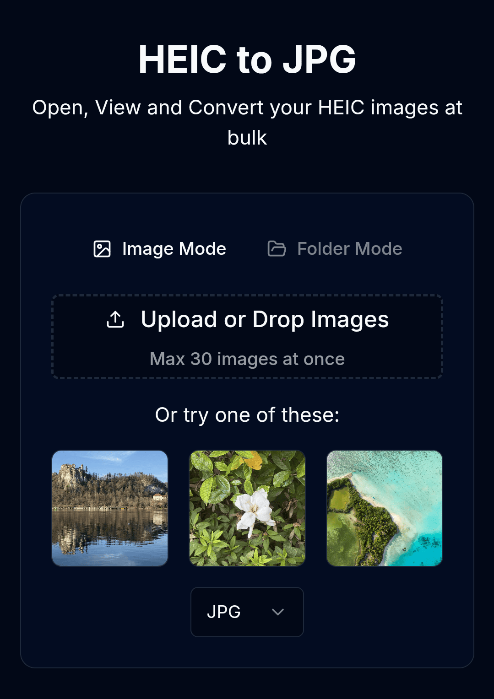

# HEIC to JPG Converter

**Convert HEIC/HEIF images to JPG or WEBP format directly in your browser - no uploads, 100% private, and completely free.**

## 🚀 Live Demo

[HEIC to JPG](https://heictojpgpro.com/)

## ✨ Features

### 💾 Multiple Format Support
- Convert HEIC/HEIF images to JPG or WEBP formats
- Share photos easily across different devices and platforms
- Eliminate compatibility issues for hassle-free photo sharing

### 🔄 Batch Processing
- Convert multiple HEIC images simultaneously
- Process images in bulk with our efficient conversion system
- Download images individually or all at once

### 🔍 EXIF Data Support
- View detailed EXIF data for your HEIC images
- Access in-depth information including GPS location

### 🔒 Privacy & Security
- **100% Local Processing** - All conversions happen directly in your browser
- **No Upload Required** - Your images never leave your device
- **Faster Conversions** - No waiting for server-side processing

### ⚡ Performance
- **Fast Conversion** - Quick conversion times with optimized local processing
- **No Conversion Limits** - Convert as many files as you need with no daily/monthly limits
- **Offline Support** - Use the app without an internet connection

## 💻 Browser Compatibility

Works seamlessly across all modern browsers:
- Chrome (recommended)
- Firefox
- Safari
- Edge

## 🛠️ How It Works

1. Click the upload button or drag and drop HEIC images
2. Select your desired output format (JPG or WEBP)
3. Convert instantly within your browser
4. Download your converted images

## 🧪 Technologies Used

- React, Tailwind CSS

## 🤝 Contributing

Contributions are welcome! Please feel free to submit a Pull Request.

1. Fork the repository
2. Create your feature branch (`git checkout -b feature/amazing-feature`)
3. Commit your changes (`git commit -m 'Add some amazing feature'`)
4. Push to the branch (`git push origin feature/amazing-feature`)
5. Open a Pull Request

## 🙏 Acknowledgements

- Thanks to all the contributors who have helped make this project better
- All users who have provided valuable feedback

---
